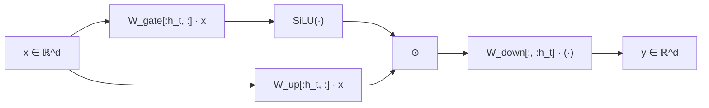
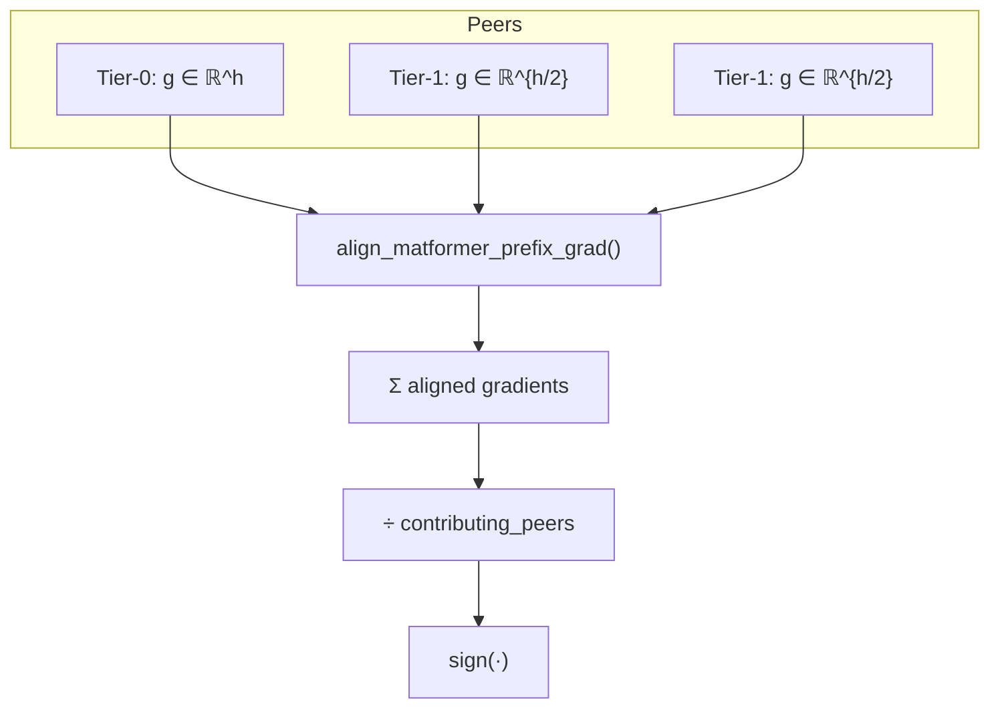
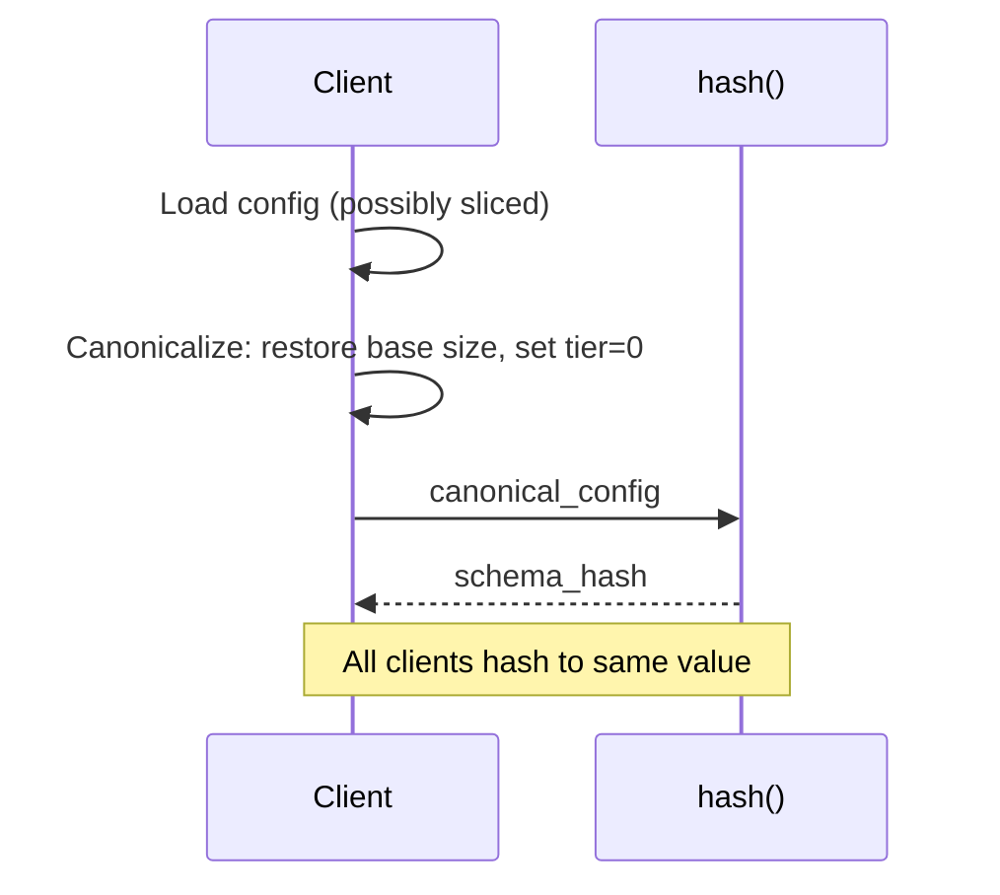

# Heterogeneous Training: Technical Reference

Formal definitions, ideas, and implementation details for MatFormer-based heterogeneous training on top of the Psyche infrastructure. For motivation and intuition, see [Heterogeneous Training](./heterogeneous-training.md).

---

## Preliminaries

Let us first formally state the FFN, and what we mean by _prefixes_ and _suffixes_, because that shall be the language we speak in for the rest of this piece.

**(Nested FFN).** Let $\text{FFN}: \mathbb{R}^d \to \mathbb{R}^d$ be a feed-forward block with hidden dimension $h$. A *nested FFN* is a family of subnetworks $\{\text{FFN}_i\}_{i=1}^g$ defined by granularities $m_1 < m_2 < \cdots < m_g = h$, where

$$\text{FFN}\_i(x) = W\_{\text{down}}^{[:, :m\_i]} \cdot \sigma\bigl(W\_{\text{up}}^{[:m\_i, :]} \cdot x\bigr)$$

The superscript notation $W^{[:m_i, :]}$ denotes the first $m_i$ rows; $W^{[:, :m_i]}$ denotes the first $m_i$ columns.

**(Tier).** A *tier* $t \in \{0, 1, \ldots, T\}$ corresponds to granularity $m_t = h / 2^t$. Tier 0 is the full model; higher tiers use exponentially smaller prefixes.

**(Prefix/Suffix Partition).** For tier $t$, the *prefix* consists of hidden units $[0, m_t)$; the *suffix* consists of units $[m_t, h)$. The suffix is empty for tier 0.

---

## The Training Objective

**Standard training** minimizes expected loss over the full model:

$$\mathcal{L}\_{\text{standard}}(\theta) = \mathbb{E}\_{(x,y) \sim \mathcal{D}}\bigl[L(M(\theta; x), y)\bigr]$$

**MatFormer training** modifies this to sample granularities:

$$\mathcal{L}\_{\text{MatFormer}}(\theta) = \mathbb{E}\_{i \sim p(i)} \mathbb{E}\_{(x,y) \sim \mathcal{D}}\bigl[L(M\_i(\theta; x), y)\bigr]$$

where $p(i)$ is a distribution over granularities. In Psyche, $p(i)$ is determined implicitly by the hardware distribution of participating clients rather than explicit sampling.

**Remark.** This is equivalent to multi-task learning where each granularity defines a task, with task weights given by $p(i)$.

---

## Why FFN?

The FFN block is the natural target for elastic width because:

1. **Parameter dominance.** In transformers with $L$ layers, hidden dimension $d$, and FFN expansion $r$ (typically $r=4$), FFN parameters scale as $2Lrd^2$ versus attention's $4Ld^2$. At standard ratios, FFN constitutes $\approx 2/3$ of total parameters.

2. **Structural independence.** FFN blocks are position-wise: $\text{FFN}(X) = [\text{FFN}(x_1), \ldots, \text{FFN}(x_n)]$. Width reduction does not require changes to sequence handling.

3. **Clean slicing.** The hidden dimension admits prefix slicing without architectural modification. Attention heads, by contrast, require either dropping entire heads or more complex per-head width reduction.

---

## Early Neurons Stabilize

**Claim.** Under MatFormer training, prefix neurons converge to representations that are useful *independently* of suffix neurons.

Three mechanisms enforce this:

The first is the fact that we penalize the model _directly_ via the loss to break permuatation invariance in the neurons. When granularity $i$ is sampled, only $M_i$ participates in the forward pass. Any parameter update that degrades $M_i$'s performance is penalized by $L(M_i(x), y)$.

Formally: let $\theta_{\text{prefix}}$ denote weights in $[0, m_1)$. These weights are in the computational graph for *all* granularities. An update $\Delta\theta_{\text{prefix}}$ that hurts $M_1$ will be punished whenever $i=1$ is sampled.

Next, note that the early neurons get many times the gradients that a small model takes. With $g$ granularities and uniform sampling $p(i) = 1/g$:

| Neuron Range | Active in Granularities | Gradient Frequency |
|--------------|------------------------|-------------------|
| $[0, m_1)$ | All $g$ | $100\%$ |
| $[m_1, m_2)$ | $\{2, \ldots, g\}$ | $(g-1)/g$ |
| $[m_{g-1}, m_g)$ | $\{g\}$ only | $1/g$ |

Prefix neurons receive $g\times$ more gradient updates than suffix neurons. This is a counting argument from the training rule.

Decompose the full model output:

$$M\_g(x) = M\_1(x) + \underbrace{\bigl(M\_g(x) - M\_1(x)\bigr)}\_{\text{suffix contribution}}$$

If $M_1$ is trained to be performant in isolation, the suffix learns a *residual correction*. The objectives are compatible, not adversarial: larger models have strictly more capacity and can represent $M_1$'s function plus refinements.

---

There are a few pertinent questions here.

*In a standard FFN, hidden neurons are exchangeable. For "the first $m$" to mean anything*, in that we are allowed to slice them later, we want to _instruct_ the model to follow a certain permutation. Affecting the structure of the neurons via the loss is not a new idea, done in 2014 as nested dropout, and in 2023 as feature sieve networks (although they use a gating mechanism, which somewhat simulates something similar to what we achieve by weighting losses leaving some parts of the network untouched).

In vanilla training, the loss is invariant under permutation of hidden units (with corresponding permutation of $W_{\text{up}}$ rows and $W_{\text{down}}$ columns). Call this the *permutation symmetry* of the FFN.

MatFormer training introduces terms $L(M_i(x), y)$ where $M_i$ uses only indices $[0, m_i)$. These terms are *not* permutation-invariant: swapping neuron 0 with neuron $h-1$ changes which subnetworks contain each neuron.

Once smaller subnetworks appear in the objective, the symmetry is broken. Position determines participation in the loss landscape.

This is the same identifiability mechanism as *nested dropout* (Rippel et al., 2014), which recovers PCA-like orderings in autoencoders by training with random truncation.

Multi-objective optimization often suffers from interference. In some sense, we can expect $M_1$ and $M_g$ to fight for gradients.

There are two ways to think about this. First, I'll explain the one I'm not _entirely_ convinced by; then, I'll explain the one that worked for _me_. 

First explanation: the relationship is nested, not arbitrary. Let $\mathcal{F}_i$ denote the function class representable by $M_i$. By construction:

$$\mathcal{F}\_1 \subset \mathcal{F}\_2 \subset \cdots \subset \mathcal{F}\_g$$

This is strict inclusion: $M_g$ can represent any function $M_1$ can, plus functions requiring the suffix.

So, if $M_1$ converges to some $f^* \in \mathcal{F}_1$, then $M_g$ can represent $f^*$ exactly (using suffix weights of zero) or improve upon it. The extra capacity is a refinement channel, not a competing objective.

Compare to *universally slimmable networks* (Yu et al., 2019) and *once-for-all* (Cai et al., 2020), which establish that nested width training converges without destructive interference when the relationship is hierarchical.

The one that made it click for me was the second explanation: that we can see it as a residual stream -- i.e, the suffix becomes a "correction", a residual, to the prefix stream. The residual decomposition here is:

$$M_g(x) = M_1(x) + \bigl(M_g(x) - M_1(x)\bigr)$$

As written, that's almost tautological — it's just adding and subtracting the same thing. The insight is in how training shapes each term.

But note what happens when it trains: When we sample granularity 1 (smallest width), only $M_1$ is in the computational graph. The loss $L(M_1(x), y)$ forces $M_1$ to be a good model by itself. It must predict well using only the prefix neurons.

When we sample granularity $g$ (full width), $M_g$ is trained. But here's the key: the prefix weights are shared. The weights that define $M_1$ are literally the same weights used in the prefix of $M_g$.

So what can the suffix weights learn? They can't contradict what $M_1$ does—those weights are fixed by the shared prefix. The suffix can only add to what the prefix computes.

Concrete example:

Say $M_1$ learns to predict "cat" with 70% confidence on some image. When $M_g$ runs on the same image:
- The prefix neurons compute the same thing (they're identical weights)
- The suffix neurons can push that 70% up to 85%, or refine the prediction

The suffix learns: "given what the prefix already figured out, what correction improves the output?"

Why this prevents fighting:

In standard multi-task learning, Task A might want weight $w$ to increase while Task B wants it to decrease. They fight.

Here, the "tasks" are nested:
- $M_1$'s task: predict well with prefix only
- $M_g$'s task: predict well with prefix + suffix

$M_g$ has strictly more capacity. If $M_1$ finds a good solution, $M_g$ can represent that exact solution (set suffix contribution to zero) and then optionally improve. There's no dimension along which they must disagree.

The residual framing:

Think of it like a residual network (ResNet). The suffix computes:

$$\text{suffix contribution} = M_g(x) - M_1(x)$$

This is the "refinement" or "correction" term. If the prefix already solved the problem, this term can be small. If the prefix got it mostly right but made systematic errors, the suffix can learn to fix those errors.

This is why larger MatFormer slices perform better—they have more capacity for corrections—while smaller slices remain functional standalone models.

---

## Gradient Isolation

**Theorem 7.1.** For tier $t > 0$, the gradient with respect to suffix weights is identically zero.

**Proof.** Let $y = \text{FFN}_t(x)$ denote the tier-$t$ output. The suffix weights $W_{\text{suffix}} = W_{\text{up}}^{[m_t:, :]}$ do not participate in the computation of $y$. By the chain rule:

$$\frac{\partial L}{\partial W\_{\text{suffix}}} = \frac{\partial L}{\partial y} \cdot \frac{\partial y}{\partial W\_{\text{suffix}}} = \frac{\partial L}{\partial y} \cdot 0 = 0$$

This is exact, not approximate. The suffix is not in the computational graph. $\square$

**Corollary 7.2.** In heterogeneous aggregation, tier-$t$ clients contribute zero to suffix gradient sums. Normalization must account for this by dividing by *contributing* peers only.

---

## Sign-SGD and Magnitude Invariance

Standard gradient aggregation:

$$g = \frac{1}{N} \sum\_{i=1}^N g\_i, \quad \theta \leftarrow \theta - \eta \cdot g$$

If $\|g_{\text{tier-0}}\| \gg \|g_{\text{tier-1}}\|$, tier-0 gradients dominate the sum.

Sign-SGD discards magnitude:

$$\theta \leftarrow \theta - \eta \cdot \text{sign}\Bigl(\sum\_{i=1}^N g\_i\Bigr)$$

Each client contributes directional information only. A gradient of $+10^{-6}$ and a gradient of $+10^{6}$ both contribute $+1$ to the sign vote. This eliminates magnitude imbalance between tiers.

**Remark.** Psyche uses DisTrO, which combines momentum, sparsification, and sign quantization. The sign operation occurs after momentum accumulation.

---

## Implementation

### 9.1 LLaMA SwiGLU

For hidden dimension $h$, model dimension $d$, and tier $t$:

$$\text{SwiGLU}\_t(x) = W\_{\text{down}}^{[:, :h\_t]} \cdot \bigl(\text{SiLU}(W\_{\text{gate}}^{[:h\_t, :]} \cdot x) \odot W\_{\text{up}}^{[:h\_t, :]} \cdot x\bigr)$$

where $h_t = h / 2^t$ and $\odot$ is elementwise multiplication.

**Weight slicing:**

| Layer | Shape | Sliced Dimension |
|-------|-------|------------------|
| `gate_proj` | $[h, d]$ | dim=0 (rows) |
| `up_proj` | $[h, d]$ | dim=0 (rows) |
| `down_proj` | $[d, h]$ | dim=1 (cols) |

**Tier calculation** (`llama.rs:296-302`):

```rust
match config.matformer_tier {
    0 => None,
    tier => {
        let divisor = 1_i64.checked_shl(tier as u32)?;
        Some(config.intermediate_size / divisor)
    }
}
```

### Forward Pass



The `.narrow()` operation creates views without copying, preserving gradient flow through the original weight tensors.

| Aspect | LLaMA | NanoGPT |
|--------|-------|---------|
| Activation | SiLU | SiLU or ReLU² |
| MLP bias | Never | Optional, incompatible with tier > 0 |

ReLU² activation (`nanogpt.rs:475-484`):

```rust
if self.use_relu_squared {
    let gate = self.gate_proj.forward(xs).relu().square();
    self.down_proj.forward(&(gate * self.up_proj.forward(xs)))
}
```

---

## Gradient Aggregation

### Heterogeneous Path

When peer shapes differ, aggregation proceeds per-parameter:



**Alignment.** Smaller gradients are zero-padded to the local shape. For `down_proj`, smaller gradients are sliced to match the prefix.

**Normalization.** Divide by the number of peers that contributed non-zero gradients to that parameter region.

### Aggregation Formulas

For prefix (all tiers contribute):

$$g\_{\text{prefix}} = \frac{1}{N} \sum\_{i=1}^N g\_i^{\text{prefix}}$$

For suffix (tier-0 only):

$$g\_{\text{suffix}} = \frac{1}{N\_0} \sum\_{j: t\_j = 0} g\_j^{\text{suffix}}$$

Implementation (`distro.rs:889-896`):

```rust
let normalized = if contributing_peers > 1 {
    combined / (contributing_peers as f64)
} else {
    combined
};
```

---

## Schema Hash Canonicalization

**Problem.** A tier-1 client with sliced checkpoint reports `intermediate_size = h/2`. A tier-0 client reports `intermediate_size = h`. Naive hashing rejects one.

**Solution.** Canonicalize to tier-0 before hashing.

**Algorithm** (`init.rs:1094-1130`):

1. If checkpoint is sliced, restore `intermediate_size` to base value: $h_{\text{base}} = h_{\text{sliced}} \cdot 2^t$
2. Set `matformer_tier = 0`
3. Store `matformer_base_intermediate_size` for downstream use
4. Hash the canonical config



---

## Verification

```bash
# Gradient isolation (suffix gradients = 0 for tier > 0)
cargo test -p psyche-modeling matformer_mlp_has_zero_tail_grads

# Gradient alignment (expand/slice operations)
cargo test -p psyche-modeling test_align_matformer_prefix_grad_expand_gate
cargo test -p psyche-modeling test_align_matformer_prefix_grad_slice_down
```

---

## Memory and Bandwidth

### Memory Savings by Scale

| Model | Embedding % | FFN % | Tier-1 | Tier-2 |
|-------|-------------|-------|--------|--------|
| 20M | 67% | 22% | ~9% | ~15% |
| 1B | 10% | 55% | ~28% | ~41% |
| 7B | 2% | 65% | ~32% | ~48% |
| 70B | <1% | 70% | ~35% | ~52% |

Savings scale with FFN fraction. At small scales, embeddings dominate.

### Bandwidth (7B Example)

Pre-compression:
- Tier-0 FFN gradient: $[11008, 4096] \times 2$ bytes = 90 MB
- Tier-1 FFN gradient: $[5504, 4096] \times 2$ bytes = 45 MB

Post-DisTrO (256× compression):
- Tier-0: 351 KB/layer
- Tier-1: 176 KB/layer

For 32 clients (8 tier-0, 24 tier-1) over 32 layers:

| Config | Bandwidth/Round |
|--------|-----------------|
| All tier-0 | 360 MB |
| Mixed | 225 MB |
| **Savings** | **37%** |

---

## Prior Work

| Work | Contribution |
|------|-------------|
| **Matryoshka Representation Learning** (Kusupati et al., 2022) | Trains embedding prefixes as strong representations; direct predecessor |
| **Nested Dropout** (Rippel et al., 2014) | Shows truncation induces ordering; recovers PCA in linear case |
| **Universally Slimmable Networks** (Yu et al., 2019) | One set of weights, many widths; sandwich rule |
| **Once-for-All** (Cai et al., 2020) | Train once, specialize many subnets |
| **DynaBERT** (Hou et al., 2020) | Elastic width/depth for transformers |
| **LayerDrop** (Fan et al., 2020) | Depth analogue; structured dropout for subnet extraction |
| **MatFormer** (Devvrit et al., 2023) | Nested transformer FFN; elastic inference |

---

## References

1. Devvrit et al. (2023). *MatFormer: Nested Transformer for Elastic Inference*. [arXiv:2310.07707](https://arxiv.org/abs/2310.07707)

2. Kusupati et al. (2022). *Matryoshka Representation Learning*. [arXiv:2205.13147](https://arxiv.org/abs/2205.13147)

3. Rippel et al. (2014). *Learning Ordered Representations with Nested Dropout*. [ICML](https://proceedings.mlr.press/v32/rippel14.html)

4. Bernstein et al. (2018). *signSGD: Compressed Optimisation for Non-Convex Problems*. [arXiv:1802.04434](https://arxiv.org/abs/1802.04434)

5. Yu et al. (2019). *Universally Slimmable Networks*. [ICCV](https://arxiv.org/abs/1903.05134)

6. Cai et al. (2020). *Once-for-All: Train One Network and Specialize it for Efficient Deployment*. [ICLR](https://arxiv.org/abs/1908.09791)

7. Hou et al. (2020). *DynaBERT: Dynamic BERT with Adaptive Width and Depth*. [NeurIPS](https://arxiv.org/abs/2004.04037)

8. Fan et al. (2020). *Reducing Transformer Depth on Demand with Structured Dropout*. [ICLR](https://arxiv.org/abs/1909.11556)
